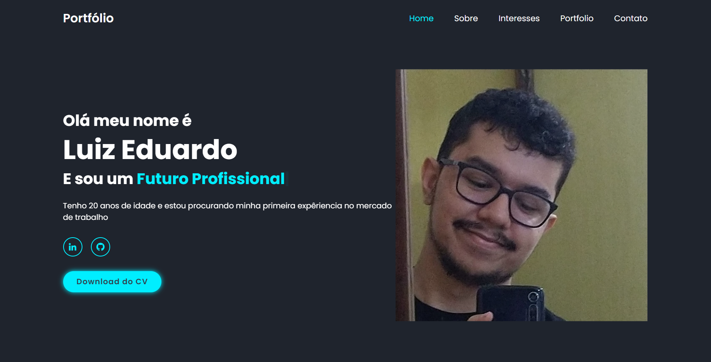

# Portfólio
Portfólio apresentando minhas habilidades e meus interesses
## Índice
- <a href="#funcionalidades">Funcionalidades do Projeto</a>
- <a href="#layout">Layout</a>
- <a href="#demonstracao">Demonstração</a>
- <a href="#tecnologias">Tecnologia Utilizadas</a>
- <a href="#autores">Pessoas Responsáveis pelo projeto</a>
- <a href="#proximospassos">Proximos Passos</a>

## 💻Funcionalidades do Projeto

- [x] Apresentar de forma rica meu perfil
- [x] Menu de navegação funcional
- [x] Site responsivo
- [x] Poder mandar um formulário ao meu email que funciona 24/7

## Layout

## Demonstração
[Link demonstração](https://luizeduardobg.netlify.app/)

## 🚀Tecnologias Utilizadas
1. HTML
2. CSS
3. JavaScript

## 👨🏼‍💻👩🏼‍💻Pessoas Autoras / Cursos responsáveis pelo projeto
1. [Luiz Eduardo Brito Gomes](https://github.com/Luiz-BG)

## 📄Proximos passos (coloque aqui as evoluções que procura no projeto pro futuro)
- [ ] Continuar a fazer atualizações de interesses meus
- [ ] Tornar o código mais consiso

 
